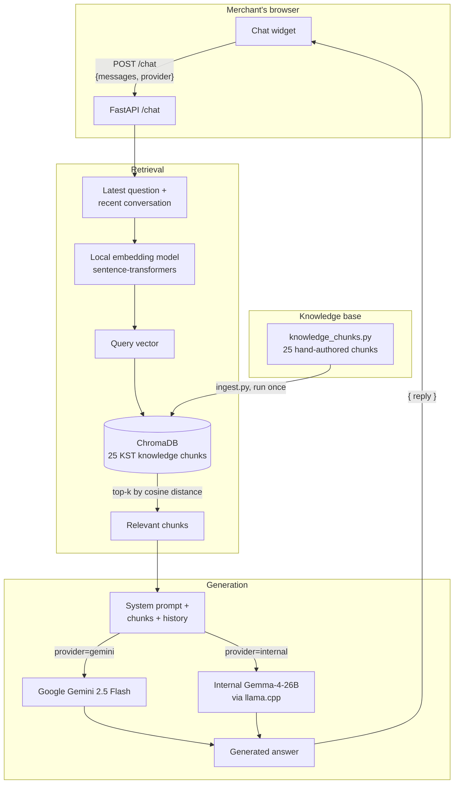

# KST Support Chatbot

A RAG (Retrieval-Augmented Generation) chatbot that answers merchant questions
about Kelkoo Sales Tracking (KST) installation and troubleshooting, embedded
in the Merchant Centre via a single `<script>` tag.

## Architecture

**Inputs:** merchant's message + conversation history + selected provider.
**Outputs:** a generated answer grounded only in the retrieved KST chunks,
plus (in the raw response) which provider/model answered and how long it took.

## Functionality

- **Retrieves relevant KST documentation per question**: embeds the query
  locally and does a dual-query (latest message + recent conversation)
  cosine-similarity search against ChromaDB — `retrieve_conversational` in
  [`backend/retriever.py`](backend/retriever.py)
- **Maintains the knowledge base**: 25 hand-authored KST documentation chunks
  (installation per platform, troubleshooting, GDPR, attribution) in
  [`backend/knowledge_chunks.py`](backend/knowledge_chunks.py), embedded into
  ChromaDB by [`backend/ingest.py`](backend/ingest.py) — run once, or whenever
  the chunks change
- **Generates grounded answers**: combines retrieved chunks with conversation
  history into a system prompt and calls the active LLM provider —
  [`backend/main.py`](backend/main.py)
- **Switches between LLM providers**: configurable via `LLM_PROVIDER` in
  `.env` (or a per-request override) — Google Gemini 2.5 Flash or Kelkoo's
  internal Gemma-4-26B via llama.cpp (OpenAI-compatible API); same RAG
  pipeline feeds either — [`backend/main.py`](backend/main.py)
- **Serves the chat widget**: dependency-free JS/CSS widget, embeddable via
  one `<script>` tag — [`frontend/kst-chatbot.js`](frontend/kst-chatbot.js),
  [`frontend/kst-chatbot.css`](frontend/kst-chatbot.css)
- **Escalates unresolved issues**: in-widget Salesforce support case form
  (UI complete; API submission not yet wired — see
  [`docs/IMPLEMENTATION_PLAN.md`](docs/IMPLEMENTATION_PLAN.md))

## Setup

1. Copy `.env.example` to `.env` and fill in the values (a Gemini API key if
   using that provider; the internal LLM URL and embedding model already have
   working defaults)
2. Run `start.bat` — creates the virtual environment, installs dependencies,
   embeds the knowledge base into ChromaDB on first run, and starts the server
3. Open http://localhost:8001

## Development

- Backend (FastAPI + RAG pipeline): `backend/`
- Frontend (chat widget): `frontend/`
- Knowledge base: `backend/knowledge_chunks.py`
- Further docs: [`docs/`](docs/) — design rationale and open decisions
  ([`DESIGN.md`](docs/DESIGN.md)), example merchant questions
  ([`example-questions.md`](docs/example-questions.md)), and the iterative
  build plan ([`IMPLEMENTATION_PLAN.md`](docs/IMPLEMENTATION_PLAN.md))

## Running Tests

No automated test suite yet.
